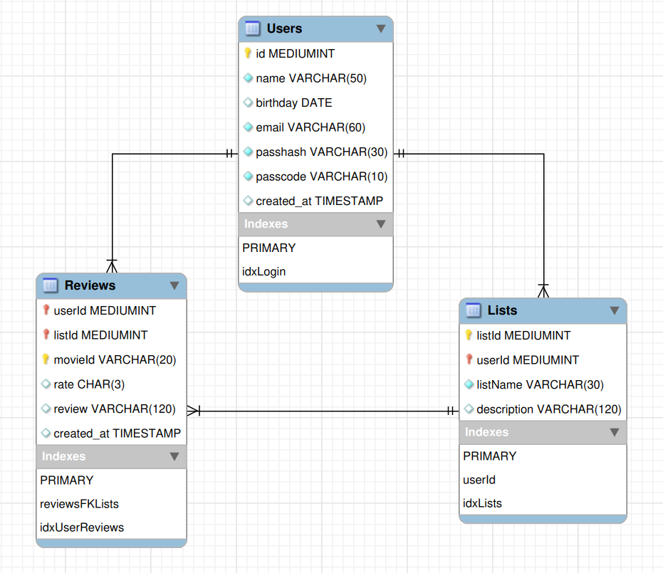

# Backend

## Refactoring

I'm currently refactoring the backend. I have rebuilt the SQL tables and will now recode the API to match the new database.

## Data Diagram

## Description

The backend consists of a docker network with two containers, one running the MySQL and the another the Node Server. MySQL has User, List and Reviews tables. Node with TS defines the EndPoints. They can be easily found in the 'routes' directory.

The TMDB (The Movie Data Base) API is used to obtain movie data, but all other data is stored in this application's own system.

- <https://developer.themoviedb.org/reference/genre-movie-list>

This application is a basic version, as there are several possible improvements, such as the handling of errors and exceptions completely, but this basic form will serve this personal purpose.

## To Do

### Transactions

It is necessary to implement transactions so that, if the results of an operation are invalidated, what was done is undone.
 
### Triggers

Whenever a user is created, they will have the following lists:

 - Favorites,
 - Watch Later,
 - Reviews.

### Exceptions

It is important to handle exceptions correctly, identifying the error and returning the necessary data.

## References

- <https://dev.mysql.com/doc/refman/8.0/en/preface.html>
- <https://restfulapi.net/http-status-codes/>
- <https://www.youtube.com/watch?v=aUMGAFE5pPM> (the most important for backend)
